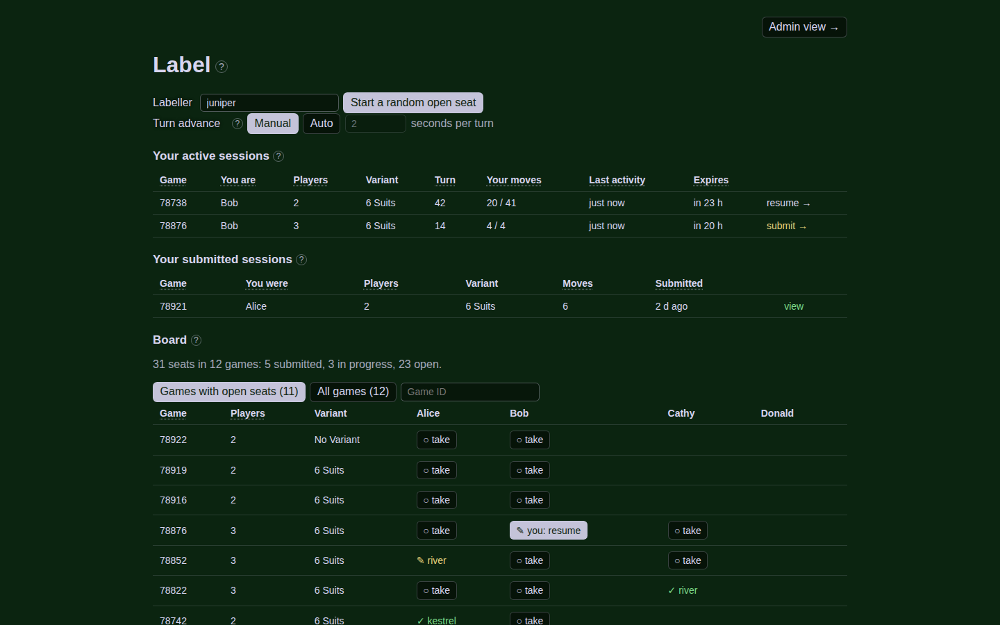
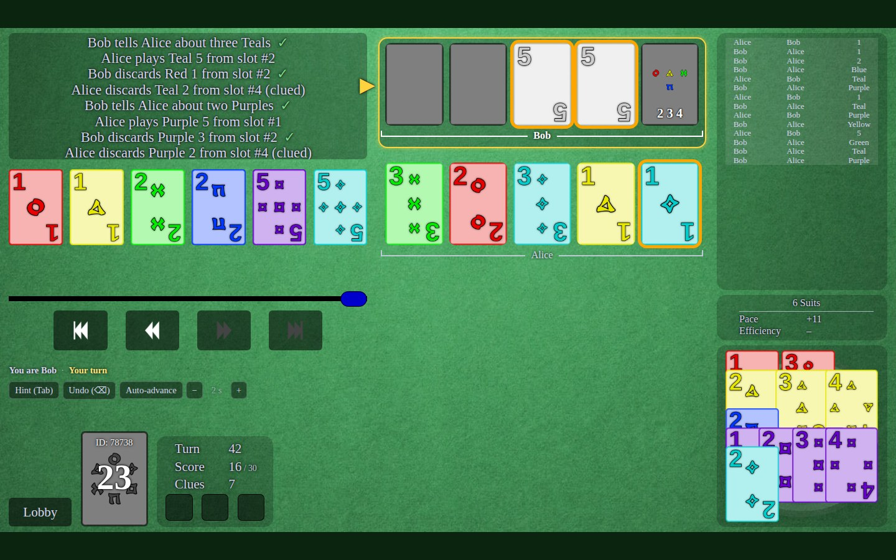
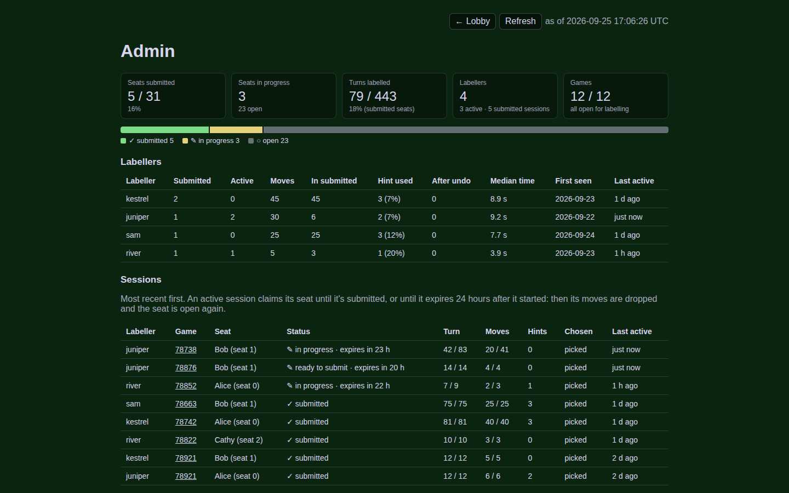

# Review tool

Design: `docs/review-tool.md`. Progress: `docs/progress.md`.

```bash
bash review/run.sh          # first run also fetches hanab.live's source and installs npm packages
# then open http://127.0.0.1:8765/
```

`run.sh` rebuilds the bundles for `examples/export_*.json` and `data/exports/export_*.json`
(fetched with `python3 -m hanabi_data.download`), builds the web app and starts the
server. Hover a card to highlight the clue log (white = touched, red = missed).

The lobby explains itself in hover tooltips: the "?" beside each heading, dotted column headings and the buttons.

*The screenshots use demo data: players anonymised, labellers made up.*



**Label mode** (lobby → "Label": enter your name, then start a random open seat, take one from the board,
or resume a session). You get one seat of a game, players anonymised. Each seat goes to one labeller: the
board shows every game by ID (with a search box) and whether each seat is open, in progress or
submitted; a claimed seat can't be taken again (you may take several seats of one game). When the game is over,
**Submit** hands the session in (fireworks, then back to the lobby); it's read-only after that. A session not submitted within 24 hours of its start
expires: its moves are deleted and the seat is open again. Left click: play your card / colour clue on a teammate's card. Right click:
discard / rank clue. Your move applies at once and the game goes on. Shift + click before the move: also
OK. Space (or →) reveals other players' moves, or set "Turn advance" to Auto in the lobby to reveal them every N
seconds (mid-game, the "Auto-advance" chip switches it and − / + change the seconds). Tab: hint (the move actually made). Backspace: undo your latest move.
Each newly revealed move plays the site's sound (hanab.live's own mp3s and rules; `serve.py --mute` turns them off).
Labels are written to `review/labels/` (`serve.py --labels DIR` to change).



**Admin view** (`#/admin`, "Admin view →" in the lobby): seats submitted / in progress / open, each
labeller's contributions, every session, coverage by game with real player names, and the games to open
in Inspect mode. Local/admin only.



**Inspect mode** keys: ← → one turn, `[` `]` one round, Home/End, `O` show/hide the top row's cards, `J`
JSON, Esc closes overlays.

| Path | What it is |
|---|---|
| `setup.sh` | One-time: sparse checkout of hanab.live at `c1d970b` into `vendor/`, `npm install`, bundle the game package for the oracle |
| `server/bundle.py` | Builds a game bundle with the engine (`hanabi_data/`) and checks it against the oracle. Exit status is non-zero on any check error |
| `server/serve.py` | Local server: `/api/games`, `/api/games/<id>/inspect`, the Label session API and the built web app |
| `server/labels.py` | Label mode: sessions, label events, and the redacted view the browser gets |
| `screenshots/` | The screenshots in this README |
| `labels/` | Label data: `sessions/<id>.json` and `<game_id>.jsonl` events. Not generated: keep it |
| `oracle/` | hanab.live's own reducer, run from Node |
| `web/` | The viewer (TypeScript + Vite). Uses hanab.live's card-drawing code, images and sounds unmodified from `vendor/` |
| `build/`, `vendor/`, `node_modules/`, `web/dist/` | Generated, not committed |

Development: `npm --prefix review run dev` (Vite on :5173, proxying `/api` to `serve.py` on :8765) and
`npm --prefix review run typecheck`.

Everything under `review/` that uses hanab.live code (`oracle/`, `web/`) is GPL-3.0, like hanab.live.
